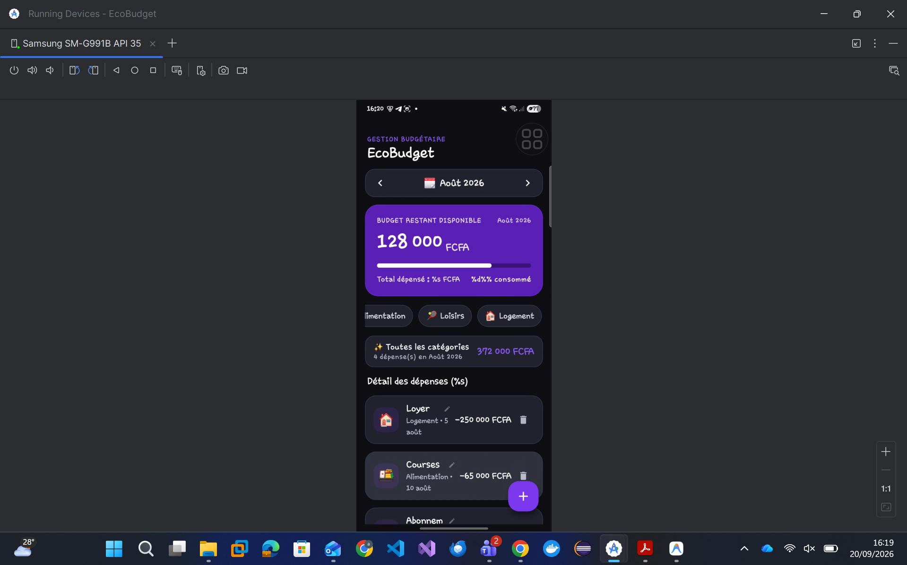
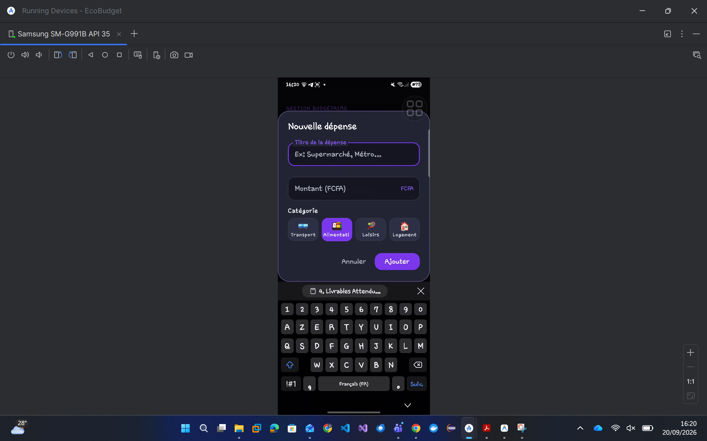

# 🌿 EcoBudget — Migration Kotlin Multiplatform (KMP) & Compose Multiplatform (CMP)

**Étudiant** : DIAGNE ALI TIEKOURA
**Dépôt GitHub** : https://github.com/pecto1/ECOBUDGET-migrationkmp
**UE** : Développement Mobile Avancé 

---

## 📌 À propos du projet EcoBudget

**EcoBudget** est une application mobile de gestion budgétaire permettant aux utilisateurs de suivre leurs dépenses quotidiennes, de les classer par catégorie et de visualiser en temps réel l'état de leur budget mensuel.

Dans le cadre du **Chapitre 3 de l'UE Développement Mobile Avancé**, ce projet a pour objectif de faire évoluer l'application Android native initiale vers une architecture **Kotlin Multiplatform (KMP)** et **Compose Multiplatform (CMP)**.

Cette migration permet de mutualiser la logique métier, les modèles de données, les dépôts et les ressources au sein d'un module partagé (`:shared`), afin de les rendre réutilisables sur Android et iOS tout en maintenant les points d'entrée spécifiques à chaque plateforme.

---

## 📸 1. Aperçu Visuel & Preuve d'Exécution
## 📸 1. Aperçu Visuel & Preuve d'Exécution

| Écran Principal | Dialogue d'Ajout / Édition |
| :---: | :---: |
|  |  |
---

## 🏗️ 2. Architecture du Module Partagé (`:shared`)

Afin de mutualiser la logique métier, les modèles de données, les dépôts et les ressources UI, l'application Android native EcoBudget a été restructurée avec un module KMP `:shared`.

### Cibles Multiplateformes (`shared/build.gradle.kts`)
- **Android Target** (`androidTarget`)
- **iOS Targets** (`iosX64`, `iosArm64`, `iosSimulatorArm64`)

### Arborescence des Source Sets
```text
shared/src/
├── commonMain/
│   ├── composeResources/
│   │   └── values/strings.xml       # Centralisation i18n
│   └── kotlin/com/example/
│       ├── data/                    # TransactionRepository, FakeTransactionRepository
│       ├── model/                   # Transaction, Category, YearMonth
│       ├── utils/                   # Abstractions expect/actual (UUID, Time)
│       └── viewmodel/               # EcoBudgetViewModel & EcoBudgetUiState
├── androidMain/
│   └── kotlin/com/example/utils/    # Implémentations actual (Android / JVM)
└── iosMain/
    └── kotlin/com/example/utils/    # Implémentations actual (iOS / Native)